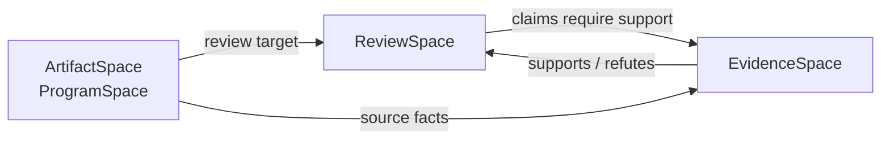

# ReviewGraphen

**ReviewGraphen** は、AIレビューを「一回の賢いプロンプト」から、**構造化されたレビュー義務を計画・実行・検証・追跡する工程**へ変える、HigherGraphen上のグラフ駆動レビュー基盤です。

> Status: Draft v0.1  
> Baseline: 2026-08-07 / HigherGraphen 0.7.1 / `CAPHTECH/higher-graphen@0f1e1cfe`  
> Methodology: Graph-Driven Review  
> Primary artifact: Review Graph  
> Initial profile: Code Review

## 問題

アプリ全体をLLMに渡して「すべてレビューせよ」と指示しても、次の理由で見落としが残ります。

- レビュー対象の探索とレビュー判断を、同じ確率的モデルへ同時に委ねている。
- LLMは「まだ見ていない対象」を厳密な集合として管理しない。
- コンテキストを増やすほど、重要な変更や関係への注意が希釈されることがある。
- 関数単体が正しくても、呼び出し関係、状態遷移、実行経路、境界規則に欠陥が生じる。
- 「レビュー済み」「証拠あり」「検証済み」が区別されず、結果の確からしさを監査できない。

ReviewGraphenは、コードグラフを単にLLMの検索補助へ使うのではありません。グラフをLLMの**外側にある制御状態**として用い、何を確認すべきか、何を確認したか、何が未確認か、どの証拠が有効かを保持します。

## 中核命題

```text
Code Graph as Context
  「LLMへ何を見せるか」を改善する

ReviewGraphen
  「何をレビューする義務があり、
    どの義務をどの文脈で実行し、
    何を証拠として採用し、
    何が未検証か」を制御する
```

LLMはレビュープロセスそのものではありません。決定論的に管理されたレビュープロセスの一つの推論器です。

## 三つの空間



- **ArtifactSpace**: レビュー対象世界。Code Reviewでは `ProgramSpace` として、ファイル、シンボル、呼び出し、依存、状態、テスト、設定などを保持する。
- **ReviewSpace**: `ReviewObligation`、レビュー実行、主張、判断、カバレッジ、未確認領域、障害構造を保持する。
- **EvidenceSpace**: 静的解析結果、テスト、実行トレース、反例、コード位置、人間判断などを保持する。

三空間を分けることで、プログラム上の事実、AIの判断、判断を支える証拠を混同しません。

## レビュー対象の五層

ReviewGraphenはASTノードだけを総当たりしません。

1. **Node**: 関数、型、ファイル、設定、テストなど。
2. **Relation**: 呼び出し、依存、所有、read/write、serialize、awaitなど。
3. **Subgraph**: Feature、bounded context、データ処理系など。
4. **Path**: ユーザー操作から永続化までの実行経路、taint path、error pathなど。
5. **Invariant**: 認証、冪等性、境界、互換性、時相的性質など。

## HigherGraphenにおける位置

ReviewGraphenは、コードレビューという一領域だけに閉じたDomain Productではなく、レビューという抽象対象を扱う**Intermediate Tool**です。

```text
HigherGraphen
  └─ ReviewGraphen
       ├─ Code Review Profile        ← 初期対象
       ├─ Architecture Review Profile
       ├─ Specification Review Profile
       ├─ Test Review Profile
       └─ AI Artifact Review Profile
```

Code Review固有のAST、CFG、DFG、CPGは外部解析器から取り込みます。HigherGraphenをパーサーやコンパイラの代替にはしません。

## 最小ワークフロー

```text
repository / diff / tests / policies
              │
              ▼
       deterministic ingestion
              │
              ▼
          ProgramSpace
              │
       obligation synthesis
              ▼
           ReviewSpace
              │
        risk-aware planning
              ▼
      bounded context projection
              │
              ▼
        LLM / analyzer / human
              │
              ▼
        claim + abstention
              │
       evidence verification
              ▼
       coverage + obstructions
              │
              ▼
   human / agent / audit projections
```

## 読み始める場所

- **今のReviewGraphenが実コードに対して何をできるか**: [`docs/23_current_capability_status.md`](docs/23_current_capability_status.md)（正典、日付入り。以下の文書群より新しい）
- 全体像: [`docs/index.md`](docs/index.md)
- 目的と非目的: [`docs/00_vision_and_scope.md`](docs/00_vision_and_scope.md)
- 研究上の位置: [`docs/02_research_foundation.md`](docs/02_research_foundation.md)
- 概念モデル: [`docs/03_conceptual_model.md`](docs/03_conceptual_model.md)
- HigherGraphen対応: [`docs/04_highergraphen_mapping.md`](docs/04_highergraphen_mapping.md)
- 実装アーキテクチャ: [`docs/05_system_architecture.md`](docs/05_system_architecture.md)
- MVP: [`docs/18_mvp_roadmap.md`](docs/18_mvp_roadmap.md)
- 実装バックログ: [`docs/19_implementation_backlog.md`](docs/19_implementation_backlog.md)

## 最初の参照シナリオ

`examples/double-submit-payment/` は、UIの二重送信が支払い処理へ到達し、冪等性境界が欠けているケースを表します。

このシナリオは次を同時に必要とするため、ASTノード単体レビューとの差を明確にできます。

- UIイベントとControllerのrelation。
- ControllerからRepository、外部決済APIへのpath。
- `at most once` というinvariant。
- 二重送信テストというevidence。
- UI contextとpayment contextのoverlap。
- 局所レビューを大域判断へ接続するgluing。

## 非目的

ReviewGraphenは次を約束しません。

- 100%の欠陥検出。
- AIによる自律的なマージ承認。
- 全言語に対する完全なcall graphやdata flow。
- LLMのconfidenceによる事実認定。
- リポジトリ全体を一つのプロンプトへ投入すること。
- MVP段階での自動修正。

## 成果の定義

ReviewGraphenの価値は「AIがレビューした」という文ではなく、次を機械可読にできることです。

```text
どのsnapshotとprofileから、どのreview obligation universeを生成したか
どの義務を実行したか
どの文脈を含め、何を投影時に失ったか
どの主張が証拠に支持・反証・未検証なのか
どの義務がstale、abstained、unverifiableなのか
どの局所結論がglueできず、大域判断を阻害しているか
```

## 文書の性格

本ドキュメント群は実装前の設計基準です。HigherGraphen 0.7.1の公開構造と既存の `pr-review` / `test-gap` 契約を基準にしていますが、ReviewGraphen自体の実装が存在することを意味しません。

**追記（2026-08-18）**: 上の一文は本ドキュメント群が最初に書かれた時点のものです。現在は `crates/` 配下に実装が存在し、テストスイートも整備されています（[`DEVELOPMENT.md`](DEVELOPMENT.md)）。実コードに対して現在何ができるかは [`docs/23_current_capability_status.md`](docs/23_current_capability_status.md) を参照してください。この一文は書き換えず、経緯として残します。

**追記（2026-08-24）**: 現在の実装状態の唯一の正典は引き続き
[`docs/23_current_capability_status.md`](docs/23_current_capability_status.md) です。
同文書は、コードと実行したテストで再現できた事項だけを「実装済」とし、
未確認事項を明記します。特に、モデル評価、Stage 0、および free-form
baseline との比較は実行されていません。したがって、本READMEは
free-form reviewとの優劣や実運用上の効用を主張しません。

## FSLとの関係

`benchmarks/`配下の一部の実験（m7-real-v1、m7-head-local-v1など）は、[FSL](https://github.com/ymm-oss/fsl)という別組織(`ymm-oss`)配下の公開リポジトリを実コードのレビュー対象として使っています。このリポジトリの運営者は`ymm-oss/fsl`のadminでもあります。

実験期間中、FSLは読み取り専用として扱われ、upstreamへのissue・branch・commit・pull requestは一切作成していません。実験完了後、運営者の判断でissue作成のみ別途許可を得て行い、投稿前に各指摘をコードリーディングと機械的な再現テストで個別に検証しました（`upstream-issues/`配下に検証記録と投稿記録があります）。投稿済みの5件は[ymm-oss/fsl](https://github.com/ymm-oss/fsl/issues)で確認できます。埋め込まれたFSLソースの帰属については[`/NOTICE`](NOTICE)を参照してください。

## Bundle artifacts

- [`MANIFEST.md`](MANIFEST.md) — 文書・schema・example・skillの構成。
- [`VALIDATION.md`](VALIDATION.md) — offline validation結果と未実行項目。
- [`DEVELOPMENT.md`](DEVELOPMENT.md) — Rust toolchain、test、lint、coverage、CIの入口。
- [`schemas/README.md`](schemas/README.md) — stable JSON contract。
- [`examples/double-submit-payment/README.md`](examples/double-submit-payment/README.md) — reference scenario。
- [`skills/reviewgraphen/SKILL.md`](skills/reviewgraphen/SKILL.md) — agent-facing workflow contract。
