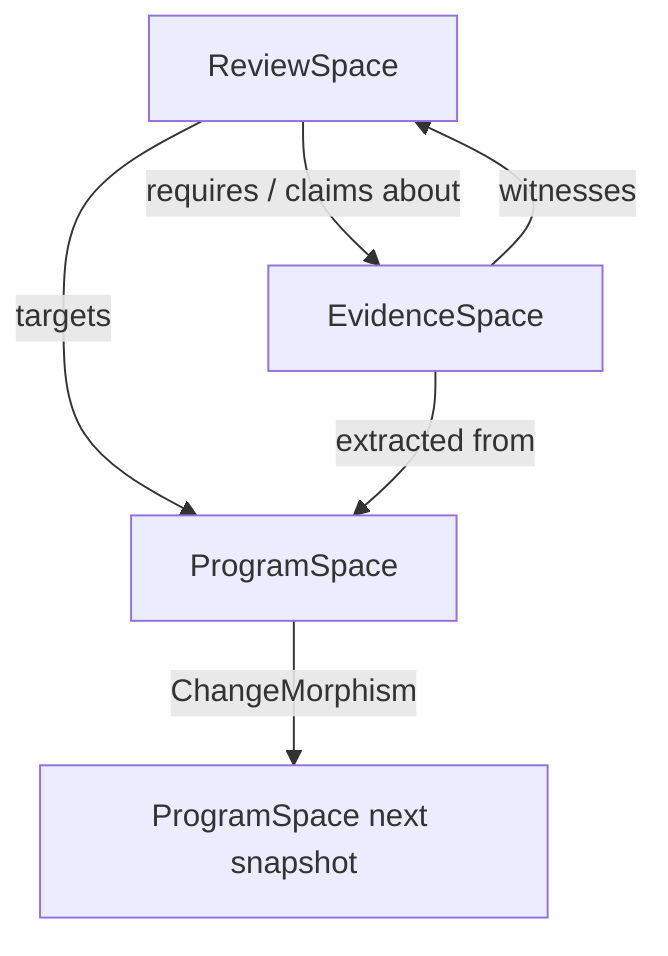

# 04. Mapping to HigherGraphen

> Status: Draft v0.1  
> Baseline: HigherGraphen 0.7.1

## 1. 基本方針

ReviewGraphenはHigherGraphenのprimitiveを再定義しません。Review domainの意味を与えるIntermediate Toolとして構成します。

```text
ReviewGraphen
  = Review Interpretation and Workflow Package
    over HigherGraphen Core, Structure, Evidence, Reasoning,
    Projection, Interpretation, and Runtime
```

AST、CFG、DFG、CPGの抽出はProgram Analysis adapterへ委譲します。

## 2. 対応表

| ReviewGraphen concept | HigherGraphen primitive | 解釈 |
| --- | --- | --- |
| ArtifactSpace / ProgramSpace | `Space` | 対象snapshotの構造世界。 |
| File / Symbol / State / Test | `Cell` | entityまたはobservation。 |
| Call / Read / Write / Dependency | `Cell`または`Incidence` | inspect対象になるrelationは1-cell化可能。 |
| Feature / Path bundle | `Complex` | 複数cellとincidenceからなるreview target。 |
| Review Context | `Context` | validity、vocabulary、policyの局所領域。 |
| Local Review Result | `Section` | context上のclaim assignment。 |
| Context overlap | `Cover` / restriction | local resultの共通領域。 |
| Local result integration | `GluingAttempt` | global conclusionを作れるかの判定。 |
| Change between snapshots | `Morphism` | preserved / lost / distorted structure。 |
| Review property | `Invariant` / `Constraint` / `Policy` | 保存すべき性質またはcheckable condition。 |
| Review blocker | `Obstruction` | counterexample、missing evidence、conflict。 |
| Missing test / API / guard | `CompletionCandidate` | 自動採用しない修復候補。 |
| Review Context Envelope | `Projection` | reviewer向けbounded viewとloss。 |
| Review evidence | `Witness` / `Derivation` / evidence records | support、refute、verification。 |
| Review scheduling | `Candidate Optimization` / weighted coverage | budget下のtarget選択。 |
| Impact analysis | `Graph Analytic` | cone、dominator、cut、centrality。 |
| Behavior property | `Temporal Property` | reachability、always-before等。 |
| Sign-off rule | `Policy` | obligation、exception、escalation。 |
| Reviewer authority | `Capability` | actor-specific operation permission。 |
| What-if fix | `Scenario` | accepted stateと混同しない仮想世界。 |

## 3. CellとIncidenceの使い分け

単純なrelationをすべてCellへ格上げすると構造が過剰になります。一方、レビュー対象になり得るrelationをIncidenceだけにするとtarget ID、property、evidence bindingが扱いにくくなります。

方針:

- containmentや単純membershipはIncidence。
- contract、ownership、call boundary、data flowなどreview対象になるrelationはtyped 1-cellとしてreify可能。
- relation間の整合性、例えば「UI→Repository direct callがarchitecture boundaryを迂回する」は2-cellまたはhigher-order constraintとして表現する。
- higher cellはpairwise relationへ還元すると意味が失われる場合だけ使う。

## 4. ReviewObligationの実装位置

`ReviewObligation` はHigherGraphen coreへ追加しません。ReviewGraphen固有typeです。

理由:

- obligationのtarget kind、property、evidence requirement、coverage semanticsはreview domain固有。
- HigherGraphenのgeneric `Obligation`やPolicyが存在する場合も、review lifecycleをそのままcoreへ押し込むべきではない。
- 他domainが共通して必要とする抽象が明らかになった時だけ、domain-neutral部分をupstreamする。

ReviewObligation自体はReviewSpaceのCellとして表し、ArtifactSpaceへのtarget morphismとEvidenceSpaceへのrequirement relationを持たせます。

## 5. 三空間とMorphism



推奨morphism:

| Morphism | Source | Target | 用途 |
| --- | --- | --- | --- |
| `review_targets` | ReviewSpace | ArtifactSpace | obligationが何を確認するか。 |
| `evidence_about` | EvidenceSpace | ArtifactSpace | evidenceの対象。 |
| `supports_claim` | EvidenceSpace | ReviewSpace | claim support/refute。 |
| `snapshot_change` | ArtifactSpace S0 | ArtifactSpace S1 | stalenessとpreservation。 |
| `review_projection` | ReviewSpace | report view | human/AI/audit出力。 |
| `context_projection` | ArtifactSpace + ReviewSpace | Envelope | LLM入力。 |

## 6. Context / Cover / Section / Gluing

ReviewGraphenがHigherGraphenを使う最大の理由の一つです。

### Context

例:

- `context:auth`
- `context:profile`
- `context:payment`
- `context:persistence`
- `context:mobile-lifecycle`
- `context:policy:pii`

### Cover

Repository全体をfeatureやrisk boundaryのcontextsでcoverします。coverは排他的partitionではありません。一つのfunctionがpayment、persistence、observabilityの複数contextに属し得ます。

### Section

各contextにおけるclaim、assumption、contract assignmentをSectionとして保持します。

### Gluing

overlap上で次を照合します。

- type/contract assumption。
- error semantics。
- idempotency boundary。
- authentication state。
- transaction ownership。
- lifecycle。
- test fixture assumption。
- exception policy。

一致しなければObstructionを作り、global sign-offを阻害します。

## 7. Invariant / Constraint / Policyの使い分け

| 種別 | 例 | 意味 |
| --- | --- | --- |
| Invariant | Payment executes at most once | 変更や経路を通じて保持すべき性質。 |
| Constraint | Every changed public API has a compatibility obligation | 現snapshotでcheckableな条件。 |
| Policy | Critical obligation requires independent verifier | 組織的な処理規則。 |
| Temporal Property | auth must occur before personal data read | trace/orderに関する性質。 |

混同すると、静的な構造規則を時相保証として誤表示したり、組織policyをprogram factとして扱う危険があります。

## 8. Obstruction

ReviewGraphenでは、次をObstructionとして表します。

- required contextを構築できない。
- symbol resolutionが失敗した。
- path conditionを検証できない。
- critical obligationが未処理。
- local claimsがoverlapで矛盾する。
- stale evidenceしか存在しない。
- projection lossがpolicy上許容できない。
- reviewer authorityが不足する。
- accepted exceptionが期限切れ。
- coverage denominatorの一部がunknown。

Findingとは異なります。Findingは対象artifactの問題候補であり、Obstructionはレビュー工程または安全な結論を阻害する理由も含みます。

## 9. CompletionCandidate

例:

- missing test。
- missing idempotency key。
- missing API boundary。
- missing null guard。
- missing invariant declaration。
- missing evidence collection step。
- missing reviewer with required capability。

候補はaccepted structureへ自動昇格しません。修正案の生成とレビュー結果の確定を分離します。

## 10. Projection

二種類を区別します。

### 10.1 Review Context Projection

LLM、static analyzer、human reviewerへ渡す作業用projection。小さく、property-specificで、lossを宣言します。

### 10.2 Result Projection

- `human_review`: actionable summary。
- `ai_view`: stable IDs、states、source traceを保つ。
- `audit_trace`: input、tool、model、decision、lossを保つ。
- `ci_gate`: pass / blocked / incompleteと理由。
- `research_export`: experiment unitとmetrics。

## 11. Graph Analytics

HigherGraphenのbounded graph analyticsは、risk signalやscheduler featureとして使えます。

- impact cone。
- articulation point / bridge。
- strongly connected component。
- dominator。
- centrality。
- cut set。

ただしanalytics scoreをseverityやtruthへ直接変換しません。centralityは優先度の一要素であり、business impactとは別です。

## 12. Temporal Property

static graphだけでは次を扱えません。

- `dispose`後にstate updateしない。
- authenticationより前にPIIをreadしない。
- payment requestはeventual completionまたはexplicit failureへ到達する。
- retryの前にidempotency keyを確立する。
- transaction begin後にcommitまたはrollbackする。

bounded checkはboundとcounterexample traceを報告し、unbounded guaranteeのように表現しません。

## 13. Interpretation Package

ReviewGraphen packageは少なくとも次を登録します。

- review vocabulary mappings。
- obligation target kinds。
- lifecycle and disposition mappings。
- generic review invariants。
- projection templates。
- profile registry。
- bounded input lift adapter。
- completion rules。
- policy templates。

Code Review profileは追加で次を登録します。

- program vocabulary。
- extraction facts。
- code review rule packs。
- code evidence kinds。
- PR projection。
- language adapter requirement。

## 14. HigherGraphen coreを変更する条件

次の条件をすべて満たす場合だけupstreamを検討します。

1. ReviewGraphen以外の複数domainで必要。
2. domain-specific vocabularyを含まない。
3. invariantsをgenericに説明できる。
4. serializationとvalidation boundaryを定義できる。
5. existing primitiveの組み合わせでは意味を失う。
6. reference fixtureが二つ以上ある。

最初からReviewGraphen都合でcoreを拡張すると、HigherGraphenの抽象層がreview productの内部モデルへ引き寄せられます。

## 15. CaseGraphenとの関係

Review runをCaseとして管理することは可能ですが、ReviewGraphenのsemantic stateをCaseGraphenへ丸ごと委譲しません。

推奨:

- ReviewGraphenがobligation、claim、evidence、coverageを所有する。
- CaseGraphenは長期作業、decision、human handoff、attachment、workflow historyを補助する。
- `ReviewRun -> Case` のmorphismを持つ。
- CaseGraphenがなくてもlocal CLIとreportは成立する。

これにより、ReviewGraphenをレビューdomainとして自立させつつ、複雑な運用ではCaseGraphenを利用できます。
