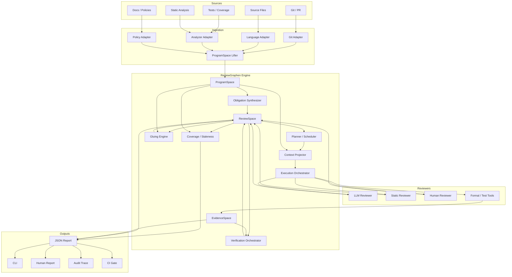

# 05. System Architecture

> Status: Draft v0.1  
> Scope: Standalone ReviewGraphen repository over HigherGraphen crates

## 1. Architecture goals

- 決定論的な構造抽出と確率的レビューを分離する。
- ProgramSpace、ReviewSpace、EvidenceSpaceを独立に保つ。
- provider、language、analyzerをadapter化する。
- CLI-first、local-firstで開始する。
- 同一stageをlibrary、CLI、将来のMCPから利用できる。
- すべてのreportをschema検証可能にする。
- incremental reviewとstalenessを後付けでなく中核に置く。
- HigherGraphen coreへreview固有概念を漏らさない。

## 2. Component diagram



## 3. 推奨workspace

```text
reviewgraphen/
  Cargo.toml
  README.md
  AGENTS.md

  crates/
    reviewgraphen-core/
    reviewgraphen-ingest/
    reviewgraphen-engine/
    reviewgraphen-reviewer/
    reviewgraphen-verifier/
    reviewgraphen-store/
    reviewgraphen-runtime/

  tools/
    reviewgraphen-cli/

  profiles/
    code-review/
      profile.toml
      rules/
      policies/
      projections/

  adapters/
    rust/
    git/
    llm/
    analyzers/

  schemas/
  examples/
  skills/
  docs/
```

MVPでcrateを細分化しすぎないよう、最初は次の四crateでもよいです。

```text
reviewgraphen-core
reviewgraphen-engine
reviewgraphen-store
reviewgraphen-cli
```

adapter traitが安定してから分離します。

## 4. Crate responsibilities

| Crate | Responsibility |
| --- | --- |
| `reviewgraphen-core` | IDs、domain records、profile/rule contract、state axes、schema-neutral validation。 |
| `reviewgraphen-ingest` | snapshot、extractor facts、ProgramSpace lift、completeness report。 |
| `reviewgraphen-engine` | obligation synthesis、planning、context projection、coverage、gluing、staleness。 |
| `reviewgraphen-reviewer` | reviewer adapter traits、structured output parsing、prompt contract。 |
| `reviewgraphen-verifier` | verifier adapter、evidence binding、verification policy。 |
| `reviewgraphen-store` | event log、artifact store、derived index、locking。 |
| `reviewgraphen-runtime` | end-to-end workflow、report envelope、policy gate。 |
| `reviewgraphen-cli` | command parsing、I/O、human formatting。 |

## 5. HigherGraphen dependency

概念上の依存:

```text
higher-graphen-core
higher-graphen-structure
higher-graphen-evidence
higher-graphen-reasoning
higher-graphen-projection
higher-graphen-interpretation
higher-graphen-runtime
        ▲
        │
reviewgraphen-core / engine / runtime
```

ReviewGraphenからHigherGraphenへ逆依存させません。

## 6. Deterministic / probabilistic boundary

### Deterministic side

- git snapshot。
- file hash。
- parser output。
- symbol table。
- accepted dependency facts。
- rule matching。
- obligation ID generation。
- context source selection。
- schema validation。
- coverage aggregation。
- staleness propagation。
- explicit verifier execution。
- report construction。

### Probabilistic side

- semantic risk hypothesis。
- business behavior interpretation。
- hidden assumption detection。
- natural language rationale。
- candidate invariant discovery。
- repair candidate generation。
- unresolved relation classification。

Probabilistic outputはすべてReviewClaimまたはCompletionCandidateとして入ります。

## 7. Processing pipeline

### Stage 0: Snapshot

Git base/head、working tree、profile、tool versionsを固定します。

### Stage 1: Ingest

adapterがaccepted factsとcompleteness declarationを出します。

### Stage 2: Lift

factsをProgramSpaceへ変換します。

### Stage 3: Synthesize

versioned rule packがReviewObligation universeを生成します。

### Stage 4: Plan

dependency、risk、budget、required verifierを考慮してReviewPlanを作ります。

### Stage 5: Project

各obligationへReviewContextEnvelopeを作ります。

### Stage 6: Execute

reviewer adapterを実行し、structured claims、abstention、raw artifactを記録します。

### Stage 7: Verify

claimごとにevidence requirementを解決し、verifierを実行します。

### Stage 8: Glue

context overlapでlocal claimsとassumptionsを照合します。

### Stage 9: Cover

multi-level coverage、unknown、stale、obstructionを集計します。

### Stage 10: Project result

human、AI、audit、CI viewを作ります。

## 8. Adapter interfaces

### 8.1 ProgramExtractor

```rust
trait ProgramExtractor {
    fn descriptor(&self) -> ExtractorDescriptor;
    fn extract(&self, snapshot: &SnapshotRef) -> Result<ExtractionBundle>;
}
```

`ExtractionBundle`:

- facts。
- unresolved references。
- excluded regions。
- completeness dimensions。
- tool diagnostics。
- provenance。

### 8.2 ObligationRule

```rust
trait ObligationRule {
    fn descriptor(&self) -> RuleDescriptor;
    fn applies(&self, view: &ProgramView) -> Applicability;
    fn synthesize(&self, view: &ProgramView) -> Result<Vec<ReviewObligation>>;
}
```

### 8.3 Reviewer

```rust
trait Reviewer {
    fn descriptor(&self) -> ReviewerDescriptor;
    fn review(
        &self,
        envelope: &ReviewContextEnvelope
    ) -> Result<ReviewExecutionResult>;
}
```

### 8.4 Verifier

```rust
trait Verifier {
    fn descriptor(&self) -> VerifierDescriptor;
    fn supports(&self, requirement: &EvidenceRequirement) -> bool;
    fn verify(
        &self,
        claim: &ReviewClaim,
        context: &VerificationContext
    ) -> Result<VerificationResult>;
}
```

### 8.5 ProjectionRenderer

```rust
trait ProjectionRenderer {
    fn render(
        &self,
        snapshot: &ReviewSnapshot,
        request: &ProjectionRequest
    ) -> Result<ProjectionResult>;
}
```

## 9. Event-driven state update

workflow内部でmutable aggregateを直接更新し続けるより、domain eventを発行します。

代表event:

```text
SnapshotCreated
ProgramFactAccepted
ProgramFactRejected
ObligationGenerated
ObligationPlanned
ContextProjected
ReviewExecutionStarted
ReviewExecutionCompleted
ClaimProposed
EvidenceRecorded
VerificationCompleted
DecisionRecorded
GluingAttempted
ObstructionRaised
RecordMarkedStale
CoverageComputed
ProjectionEmitted
```

event logからcurrent Review Graphを再構築できるようにします。

## 10. Parallelism

obligation graphで依存しないwork itemは並列実行できます。

```text
ready(o) =
  dependencies completed
  AND required context available
  AND no blocking policy obstruction
```

ただし並列化は次を壊してはいけません。

- 同じtargetへの矛盾した同時write。
- shared token/cost budget。
- verifier resource limit。
- deterministic ordering of emitted IDs。
- gluing前提のlocal sections。
- rate limitとsecret boundary。

parallel execution resultはevent orderingとは分離し、stable logical sequenceでcommitします。

## 11. Error model

### Tool error

入力schema不正、I/O失敗、parser crash、provider failure。CLIはnon-zeroで終了し、partial stateを明示します。

### Domain obstruction

required evidence不足、gluing conflict、critical obligation未処理。valid reportとして返し、gate policyが判定します。

### Reviewer abstention

判断不能。errorにせずClaimまたはExecution outcomeとして記録します。

### Unsupported capability

adapterがpropertyを検証できない。`unsupported` evidence outcomeとcapability obstructionを出します。

## 12. Observability

最低限記録するもの:

- stage duration。
- facts / obligations / claims / evidence件数。
- token / provider cost。
- cache hit。
- retry。
- unresolved reference。
- verification pass/fail/inconclusive。
- coverage transition。
- staleness cause。
- projection size and loss。
- raw artifactsのcontent hash。

telemetryを外部送信する必要はありません。local audit logが初期要件です。

## 13. Extension points

- language extractor。
- graph backend。
- reviewer provider。
- verifier tool。
- review profile。
- rule pack。
- risk model。
- policy gate。
- projection renderer。
- hosted orchestration。

extensionはschemaとcapability descriptorを通じて発見し、core internal typeへの非公開依存を避けます。

## 14. Architecture tests

必須contract test:

1. same input → same obligation IDs。
2. model output cannot create accepted fact。
3. stale evidence cannot satisfy gate。
4. context projection retains source trace。
5. omitted source creates declared loss。
6. conflicting sections create gluing obstruction。
7. missing verifier creates `unsupported` rather than pass。
8. incomplete extraction lowers completeness and blocks strict gate。
9. provider failure preserves completed events。
10. report round-trip preserves state axes。
